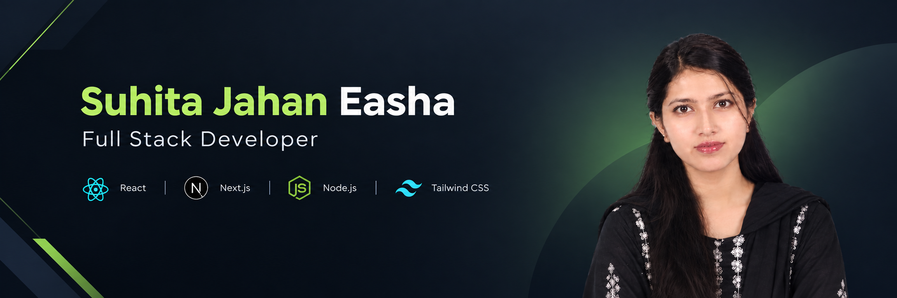

  

<h1 align="center">Suhita Jahan Easha</h1>

  Full Stack Developer · CSTE Graduate · Web Development Enthusiast

  
  

---

## About

I am a **Computer Science and Telecommunication Engineering (CSTE) graduate from Noakhali Science and Technology University (NSTU)** with a strong interest in modern web development and software engineering.

I build responsive, user-focused web applications and continuously improve my skills through hands-on projects and practical development.

My current focus is **full-stack development with React, Next.js, Node.js, and modern database technologies**, while also exploring AI-assisted development.

---

## Tech Stack

### Frontend

  

### Backend & Database

  

### Tools

  

---

## Areas of Focus

- Full-stack web application development
- Responsive and accessible user interfaces
- REST API development
- Database-driven applications
- Authentication and application security
- Modern React and Next.js development
- AI-assisted software development

---

## What I Build

I enjoy working on projects that combine **clean interfaces, practical functionality, and reliable application architecture**.

My projects focus on:

- Building responsive web experiences
- Creating reusable React components
- Developing full-stack applications
- Working with APIs and databases
- Solving real-world development problems

---

## Currently Learning

- Advanced Next.js and React
- Backend architecture with Node.js and Express
- Database design and optimization
- Full-stack application development
- AI-assisted development workflows

---

## Let's Connect

I'm always interested in learning, building, and connecting with other developers.

  <a href="mailto:suhitajahaneasha@gmail.com">Email</a> ·
  <a href="https://github.com/suhitajahan-Easha">GitHub</a>

